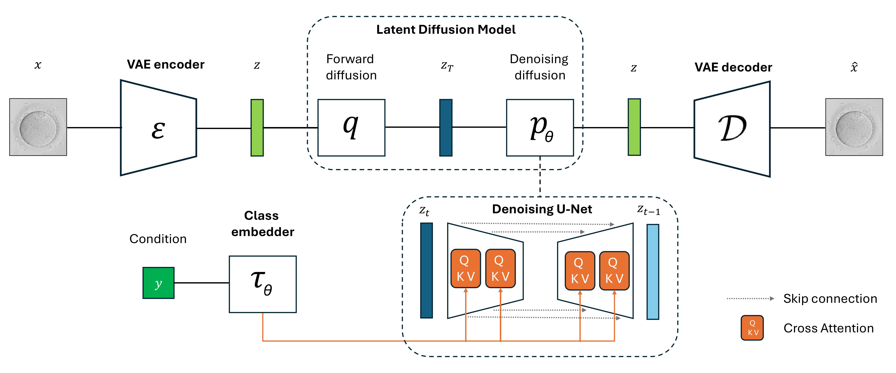
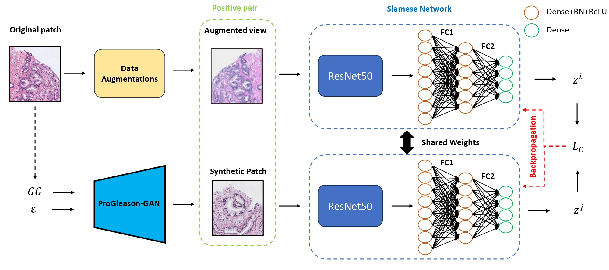

# AI Engineer

## About Me
Industrial engineer specialized in artificial intelligence. Quick learner, adaptable, and goal-oriented professional committed to delivering results responsibly and efficiently.

---

## Education
- **PhD in Health and Wellness Technologies (AI Focus)** — *Polytechnic University of Valencia (UPV)*  
  *2022 – Present*

- **Master’s Degree in Artificial Intelligence** — *Valencian International University (VIU)*  
  *2021 – 2022*

- **Master’s Degree in Industrial Engineering** — *Polytechnic University of Valencia (UPV)*  
  *2018 – 2021*

- **Bachelor’s Degree in Industrial Technologies Engineering** — *Polytechnic University of Valencia (UPV)*  
  *2014 – 2018*

---

## Work Experience
### **AI Engineer** — *CVBLAB (UPV)*  
*2021 – Present*  
- Conducted research and trained state-of-the-art generative models (GANs, Diffusion Models) for high-fidelity image generation.  
- Built CBIR systems, improving image search accuracy and speed.  
- Processed and cleaned large multimodal datasets for model training.  
- Optimized training pipelines, reducing GPU/TPU time.  
- Fine-tuned pre-trained models for vision and multimodal tasks.  
- Evaluated models using quality, diversity, and relevance metrics.  
- Led cross-functional teams in AI projects, coordinating meetings, timelines, and deliverables.  
- Built and optimized deep learning models for medical image analysis to support cancer detection.

---
## Projects

### BlastDiffusion: A Latent Diffusion Model for Generating Synthetic Embryo Images to Address Data Scarcity in In Vitro Fertilization

**[Code](#)** | **[Publication](https://link.springer.com/chapter/10.1007/978-3-031-98688-8_15)**

Accurately identifying oocytes that progress to the **blastocyst stage** is crucial in reproductive medicine.  
We propose **BlastDiffusion**, a **generative model based on Latent Diffusion Models (LDMs)**, which synthesizes realistic oocyte images **conditioned on developmental outcomes**, addressing the challenges of limited annotated embryo datasets.

#### Key Highlights
- Utilizes a **pretrained Variational Autoencoder (VAE)** for latent space representation combined with a diffusion process to generate realistic images.  
- Produces synthetic images that differentiate **oocytes that reach the blastocyst stage** from those that do not.  
- Achieves superior performance compared to GAN-based models
- Qualitative analysis shows the model captures **key morphological differences** linked to developmental outcomes.  
- Demonstrates the **potential of diffusion models** for **data augmentation** and **automated embryo assessment** in IVF.
  

### **Enhancing Image Retrieval Performance with Generative Models in Siamese Networks**  
**[Code](https://github.com/cvblab/CBIR_SYNTHETIC_VIEWS)** | **[Publication](https://ieeexplore.ieee.org/abstract/document/10896802)**  

  

This research addresses the challenges of **prostate cancer diagnosis**, one of the most prevalent cancers among men worldwide.  
We propose a **Siamese Network** approach to encode image patches into latent representations for **Content-Based Image Retrieval (CBIR)** tasks, leveraging **generative deep learning models** to improve retrieval quality.  

Key highlights:
- Leveraging the **ProGleason-GAN** framework trained on the **SiCAPv2 dataset** for generating synthetic patches.  
- Achieved **notable improvements** in retrieval metrics with synthetic data augmentation.  
- First approach where **CBIR-optimized latent representations** are used to train an attention mechanism for **Gleason Scoring** of Whole Slide Images (WSI).  

---

### ProGleason-GAN: Conditional Progressive Growing GAN for Prostatic Cancer Gleason Grade Patch Synthesis

**[Code](https://github.com/cvblab/ProGleason-GAN)** | **[Publication](https://www.sciencedirect.com/science/article/pii/S0169260723003607)**

This research focuses on **prostate cancer**, one of the most common diseases affecting men worldwide.  
We propose **ProGleason-GAN**, a **conditional Progressive Growing GAN** designed to **synthesize histopathological patches** of prostate tissue for **data augmentation**, addressing the challenges of **insufficient and unbalanced datasets** in Gleason grading models.

Key Highlights
- Conditional GAN architecture capable of generating patches for **non-cancerous patterns, GG3, GG4, and GG5** by embedding Gleason grade information.
- External validation performed by **expert pathologists** confirmed the realism of the synthetic samples.  
- Significant improvement in **classification performance** on the **SiCAPv2 dataset** with synthetic data augmentation.

## Skills
### **Technical Skills**
- **Programming & Frameworks:** Python, PyTorch, TensorFlow, Hugging Face, OpenCV, NumPy, Pandas  
- **Generative AI:** GANs, Diffusion Models, Transformers, LLMs  
- **Computer Vision & CBIR:** Image retrieval, object detection, segmentation, multimodal data processing  
- **ML Engineering & Pipelines:** Data preprocessing, model training, hyperparameter tuning, GPU/TPU optimization  
- **Research & Evaluation:** Model metrics, fine-tuning, transfer learning  
- **Tools & Deployment:** Git, Docker, Colab, Hugging Face Spaces, basic Streamlit  

### **Leadership & Product Skills**
- Project management, team coordination, roadmap planning  
- Translating research into deployable AI solutions  
- Cross-functional team leadership and stakeholder communication  

---

## Languages
- **English:** Proficient  
- **Valencian:** Native  
- **Spanish:** Native  

---

## Contact
- 📧 **Email:** alejandrogolfe@gmail.com  
- 📱 **Phone:** +34 627 245 209  
- 📍 **Location:** Valencia, Spain  
